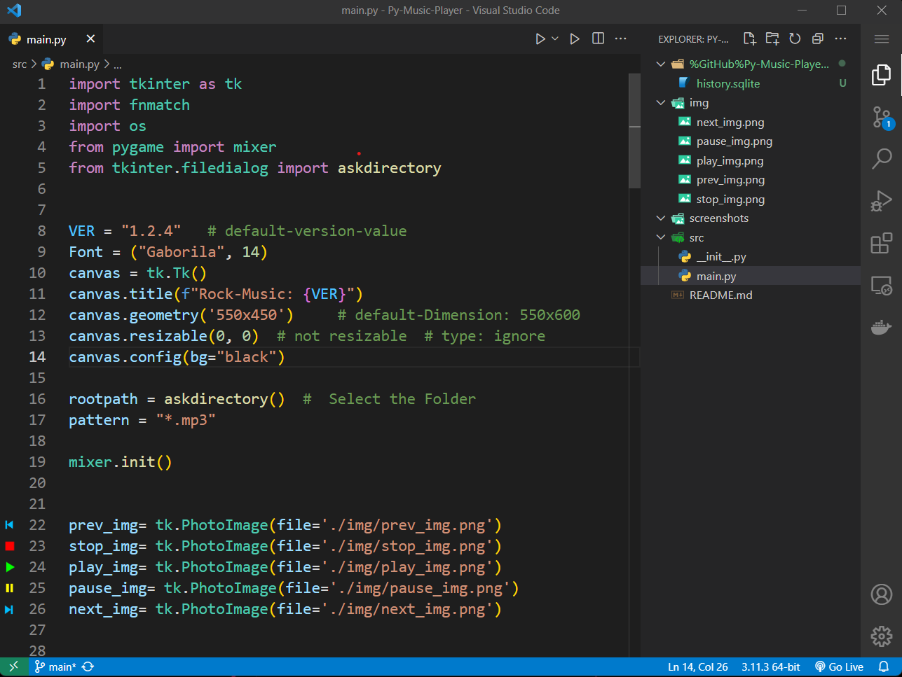
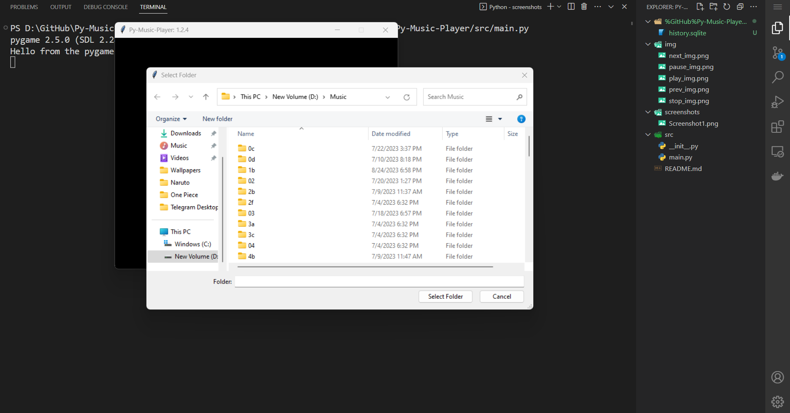
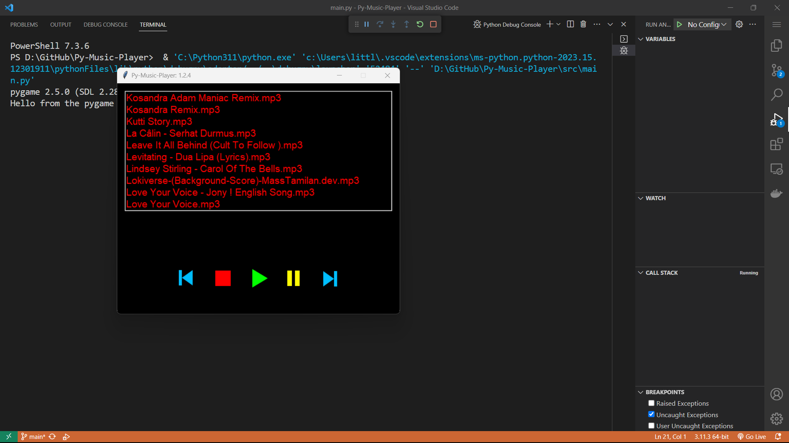

# Simple Python Music Player

This is fun project build on **Python** programming language. This project is fully written in python.

## Steps to run the `Py-Music-Player` application.
- **Step 1:** main.py code
  
   

- **Step 2:** Then Choose the Folder containing `*.mp3` files.

  

- **Step 3:** Select the song, then click the `Play` button to play the song.
  
  

## Contributing
Feel free to modify this template to better suit your project’s specific needs. If you need further customization or have any questions, let me know!
